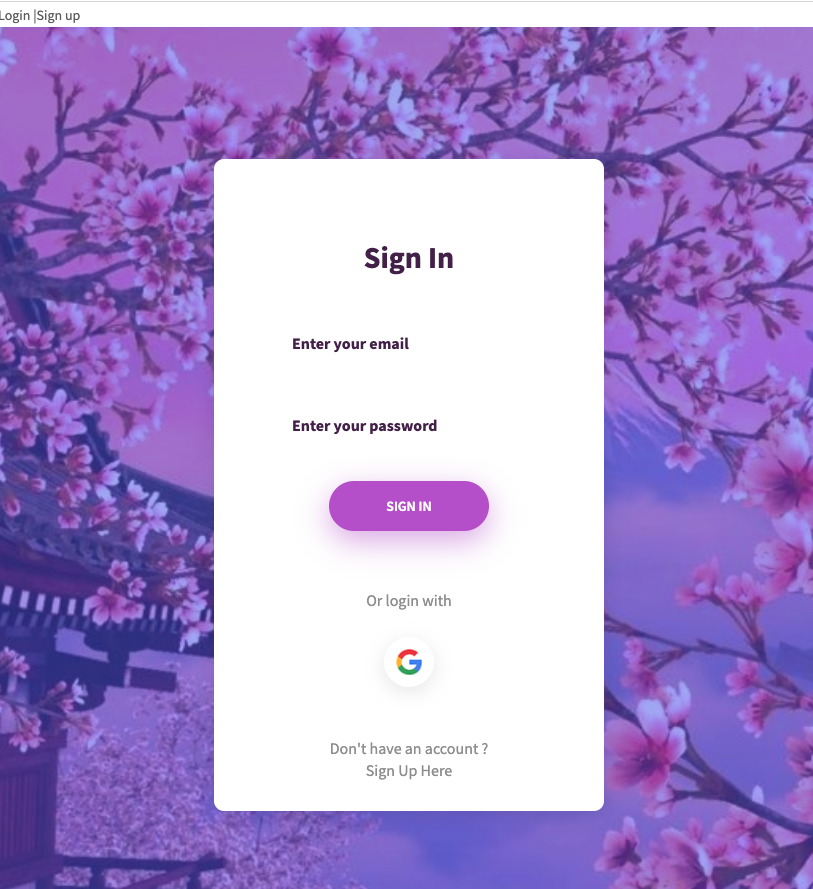
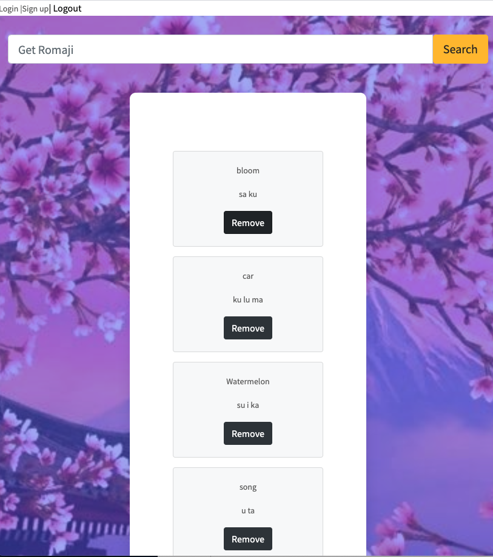

# Project Intro:

When you are travelling to Japan, type english and get the japanese romaji pronunciation directly.
You can save your search result and make a study notes.

For more, check it here 👉 https://review-cards-b329b.web.app/

Special thanks to Jisho api : https://jisho.org/, it is all free !

# Teck stacks

firebase (firestore, firebase auth, firebase hosting)
Vue.js Vuex

  

  

